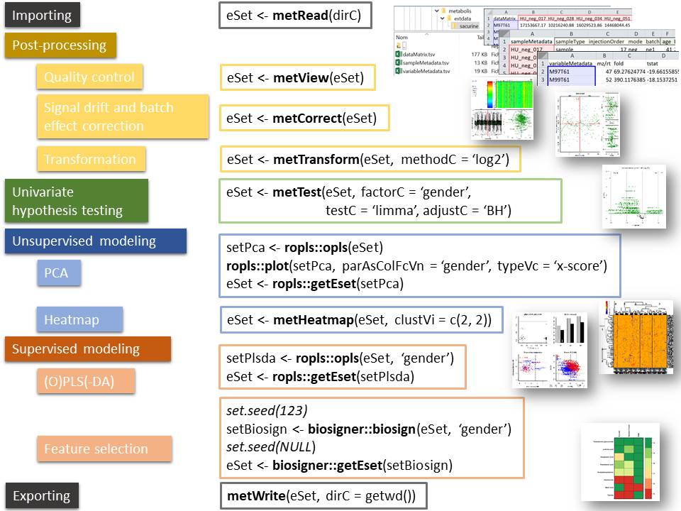

# **metabolis**: An R package for metabolomics data analysis

## Description

This package provides methods to perform the statistical analysis of metabolomics datasets. These methods include the reading of datasets (as 3 table *dataMatrix*, *sampleMetadata* and *variableMetadata* .tsv files) into an *ExpressionSet* object (*metRead*), quality control (*metView*) and transformation (*metTransform*) of the dataMatrix, and univariate hypothesis testing (*metTest*). Multivariate analysis and feature selection can be further performed with the *ropls* and *biosigner* packages, respectively (see the *sacurine* vignette).

## Author

Etienne A. Thevenot ([https://etiennethevenot.pagesperso-orange.fr/](https://etiennethevenot.pagesperso-orange.fr/))

## Methods



## Formats

### 3 tabular file format used for import/export

Input (i.e. preprocessed) data consists of a 'samples times variables' matrix of intensities (**datMatrix** numeric matrix), in addition to sample and variable metadata (**sampleMetadata** and **variableMetadata** data frames). Theses 3 tables can be conveniently imported to/exported from R as tabular files:


### **ExpressionSet** class used within the data analysis workflow

Within the R workflow, the **ExpressionSet** class perfectly handles these 3 tables (for additional information about *ExpressionSet* class, see the ['An introduction to Biobase and ExpressionSets'](https://bioconductor.org/packages/release/bioc/vignettes/Biobase/inst/doc/ExpressionSetIntroduction.pdf) documentation from the [**Biobase**](https://doi.org/doi:10.18129/B9.bioc.Biobase) package).

## Installation

```r
install.packages("devtools", dep=TRUE)  
devtools::install_github("https://github.com/ethevenot/metabolis")
```

## Tutorial

See the [**metabolis vignette**](vignettes/metabolis.Rmd) for a detailed example of the analysis of a metabolomics dataset.

## Acknowledgements

This package was developed within the [**Metabolomics Data Sciences and Integration team**](https://etiennethevenot.pagesperso-orange.fr/) at CEA, including Natacha Lenuzza, Pierrick Roger, Philippe Rinaudo, Alexis Delabriere, Camille Roquencourt, Alyssa Imbert.

Interactions with experiments from the [**Drug Metabolism Research Laboratory**](http://joliot.cea.fr/drf/joliot/en/Pages/research_entities/medicines_healthcare_technologies/spi.aspx) were critical to develop optimal methods for quality control and normalization, including Aurelie Roux, Samia Boudah, Florence Castelli, Benoit Colsch, Christophe Junot, Francois Fenaille.

Discussions with bioinformaticians and biostatisticians from the [**MetaboHUB**](http://www.metabohub.fr/home.html) infrastructure for metabolomics and fluxomics, and the [**Workflow4metabolomics**](https://workflow4metabolomics.org/) Galaxy project were also of high value, including Marie Tremblay-Franco, Jean-Francois Martin, Melanie Petera, Yann Guitton, Gildas Le Corguille, Christophe Caron, Fabien Jourdan, Dominique Rolin.
