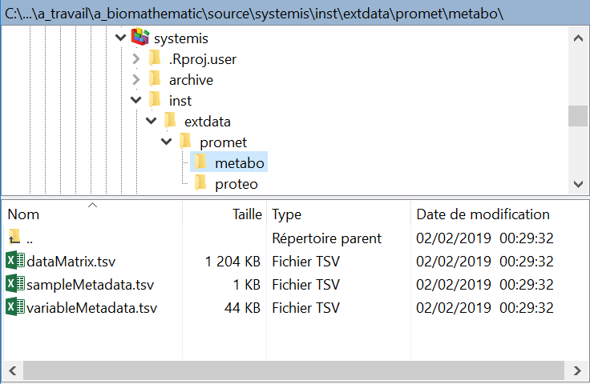

```{r global_options, include=FALSE}
knitr::opts_chunk$set(fig.width = 8,
                      fig.height = 8,
                      fig.path = 'figures/metabolis')
```

# Loading package

```{r package}
suppressMessages(library(metabolis))
```

# Loading data

The two datasets *metabo* and *proteo* from the *promet* study are stored as subfolders. Each contains the 3 *dataMatrix.tsv*, *sampleMetadata.tsv*, and *variableMetadata.tsv* tabulated files (Figure 1).



The **metRead** function reads the data sets and build the *MultiDataSet* object. The *MultiDataSet* class is an extension of *ExpressionSet* to handle multi-omics datasets [[@hernandez-ferrer_multidataset:_2016]](https://doi.org/10.1186/s12859-016-1455-1). For additional information about *ExpressionSet* class, see the "An introduction to Biobase and ExpressionSets" documentation from the [Biobase](https://doi.org/doi:10.18129/B9.bioc.Biobase) package.

```{r load}
prometMset <- metabolis::metRead(system.file("extdata/promet", package = "metabolis"))
```

# Viewing data (and getting quality metrics)

The **metView** method provides numerical and graphical summary of the datasets.

```{r metView}
prometMset <- metabolis::metView(prometMset)

```

A factor of interest may be specified to color the samples. The **metTest** method is called internally to perform by univariate (non-parametric) hypothesis testing, with the Benjamini-Hochberg correction for multiple testing [[@benjamini_controlling_1995]](http://www.jstor.org/stable/2346101). The number of significant variables at the *adjustThreshN* threshold (default is 5%) is displayed among the metrics.

```{r metView gene}
prometMset <- metabolis::metView(prometMset, factorC = "gene")
```

# Univariate hypothesis testing

The **metTest** method enables to perform univariate hypothesis testing with correction for multiple testing. Three parametric tests are available (as well as the corresponding non-parametric tests), depending on the nature of the factor (qualitative or quantiative), and, in the case of a qualitative factor, the number of its levels:

|Factor      |Levels | Test                                                                                   | testC        |
|------------|-------|----------------------------------------------------------------------------------------|--------------|
|Qualitative | 2     | Parametric: [Student t-test](http://purl.obolibrary.org/obo/OBI_0000739)               | **ttest**    |
|            |       | Non-parametric: [Wilcoxon rank sum test](http://purl.obolibrary.org/obo/STATO_0000076) | **wilcoxon** |
|            | > 2   | Parametric: [Analysis of variance](http://purl.obolibrary.org/obo/OBI_0200201)         | **anova**    |
|            |       | Non-parametric: [Kruskal-Wallis test](http://purl.obolibrary.org/obo/STATO_0000094)    | **kruskal**  |
|Quantitative|       | Parametric: Pearson correlation test                                                   | **pearson**  |
|            |       | Non-parametric: Spearman correlation test                                              | **spearman** |
|------------|-------|----------------------------------------------------------------------------------------|--------------|

Let us perform a *Wilcoxon rank sum test* for the comparison of medians between the two genotypes:

```{r metTest show, eval = FALSE}
prometMset <- metabolis::metTest(prometMset, factorC = "gene", testC = "wilcoxon")
```

```{r metTest run, echo=FALSE}
prometMset <- metabolis::metTest(prometMset, factorC = "gene", testC = "wilcoxon", fig.pdfC = NULL, info.txtC = NULL)
```

Three columns are added to each fData slot after this *Wilcoxon* test: the difference between the medians from the 'W' minus the 'L' classes, the adjusted p-value (here the default "BH" correction was used), and an indicator of the significance of this adjusted p-value (here the default 0.05 threshold was used):

```{r metTest metView}
lapply(Biobase::fData(prometMset), head)
```

The number of significant variables for each data can be obtain with:

```{r metTest signif}
sapply(Biobase::fData(prometMset),
       function(fdata) sum(fdata[, grep("gene_wilcoxon_.+_sig", colnames(fdata))]))
```


# References