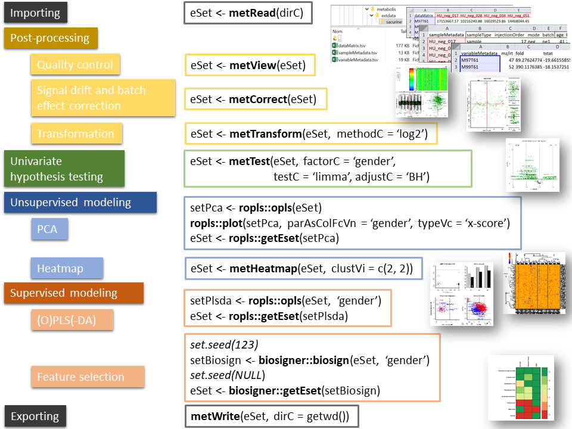

```{r global_options, include=FALSE}
knitr::opts_chunk$set(fig.width = 8,
                      fig.height = 8,
                      fig.path = 'figures/temp/')
```

# Introduction

## Context

Analysis of a metabolomics data set (i.e. samples times variables table of peak or bucket intensities generated by preprocessing tools such as XCMS) is aimed at **mining the data** (e.g. trends and outliers) and detecting features of predictive value (**biomarker discovery**). It comprises multiple steps including:

* **Post-processing** (quality control, normalization and/or transformation of intensities)

* **Univariate hypothesis testing**

* **Multivariate modeling**

The **metabolis** package addresses the two first steps, and can be combined with other packages for multivariate modeling, such as the [**ropls**](https://doi.org/10.18129/B9.bioc.ropls) and [**biosigner**](https://doi.org/10.18129/B9.bioc.biosigner) Bioconductor packages, as described below.

## Methods



## Formats

### 3 tabular file format used for import/export

Input (i.e. preprocessed) data consists of a 'samples times variables' matrix of intensities (**datMatrix** numeric matrix), in addition to sample and variable metadata (**sampleMetadata** and **variableMetadata** data frames). Theses 3 tables can be conveniently imported to/exported from R as tabular files:


### **ExpressionSet** class used within the data analysis workflow

Within the R workflow, the **ExpressionSet** class perfectly handles these 3 tables (for additional information about *ExpressionSet* class, see the ['An introduction to Biobase and ExpressionSets'](https://bioconductor.org/packages/release/bioc/vignettes/Biobase/inst/doc/ExpressionSetIntroduction.pdf) documentation from the [**Biobase**](https://doi.org/doi:10.18129/B9.bioc.Biobase) package). The following table describes useful Biobase methods for the handling of ExpressionSet objects: 

| Biobase methods | Description |
|---|---|
| **exprs(eset)** | 'variable times samples' numeric matrix - dataMatrix |
| **pData(eset)** | sample metadata data frame - sampleMetadata |
| **fData(eset)** | variable metadata data frame - variableMetadata |
| **sampleNames(eset)** | sample names |
| **featureNames(eset)** | variable names |
| **dims(eset)** | 2-element numeric vector of 'Features' and 'Samples' dimensions |
| **varLabels(eset)** | Column names of the sampleMetadata, pData(eset) |
| **fvarLabels(eset)** | Column names of the variableMetadata, fData(eset) |

### **MultiDataSet** class for multiple datasets

All *metabolis* methods (including *metRead* and *metWrite*) can also be applied to multiple omics datasets: in this case, the **MultiDataSet** class is used instead of *ExpressionSet* [[@hernandez-ferrer_multidataset:_2016]](https://doi.org/10.1186/s12859-016-1455-1).

## Text and graphical outputs

Text and graphics can be handled with the *metabolis* methods by setting the two arguments:

* **info.txtC**: if set to NA [default], messages are displayed interactively; if set to a character corresponding the a filename (with the '.txt' extension), messages are diverted to this file by using the *sink* function internally (the same file can be appended by successive methods); if set to NULL, messages are suppressed

* **fig.pdfC**: if set to NA [default], graphics are displayed interactively; if set to a character corresponding the a filename (with the '.pdf' extension), a pdf file with the plot is generated instead; if set to NULL, graphics are suppressed

## Availability

The [**metabolis**](https://github.com/ethevenot/metabolis) package can be installed from [**github**](https://github.com/):

```{r installation, eval = FALSE}
install.packages("devtools", dep=TRUE)  
devtools::install_github("https://github.com/ethevenot/metabolis")
```

## Acknowledgements

This package was developed within the [**Metabolomics Data Sciences and Integration team**](https://etiennethevenot.pagesperso-orange.fr/) at CEA, including Natacha Lenuzza, Pierrick Roger, Philippe Rinaudo, Alexis Delabriere, Camille Roquencourt, Alyssa Imbert.

Interactions with experiments from the [**Drug Metabolism Research Laboratory**](http://joliot.cea.fr/drf/joliot/en/Pages/research_entities/medicines_healthcare_technologies/spi.aspx) were critical to develop optimal methods for quality control and normalization, including Aurelie Roux, Samia Boudah, Florence Castelli, Benoit Colsch, Christophe Junot, Francois Fenaille.

Discussions with bioinformaticians and biostatisticians from the [**MetaboHUB**](http://www.metabohub.fr/home.html) infrastructure for metabolomics and fluxomics, and the [**Workflow4metabolomics**](https://workflow4metabolomics.org/) Galaxy project were also of high value, including Marie Tremblay-Franco, Jean-Francois Martin, Melanie Petera, Yann Guitton, Gildas Le Corguille, Christophe Caron, Franck Giacomoni, Fabien Jourdan, Dominique Rolin.

# Hands-on

## The **sacurine** cohort study

As an example, we will use the **metabolis** package to study the **sacurine** human cohort. The study is aimed at characterizing the physiological variations of the human urine metabolome with age, body mass index (BMI), and gender [[@thevenot_analysis_2015]](https://doi.org/10.1021/acs.jproteome.5b00354). Urine samples from 184 volunteers were analyzed by reversed-phase (C18) ultrahigh performance liquid chromatography (UPLC) coupled to high-resolution mass spectrometry (LTQ-Orbitrap). Raw data are publicly available on the MetaboLights repository ([MTBLS404](https://www.ebi.ac.uk/metabolights/MTBLS404)).

This vignette describes the statistical analysis of the data set from the negative ionization mode (113 identified metabolites at MSI levels 1 or 2):

* **metCorrect**: Correction of the signal drift by local regression
(loess) modeling of the intensity trend in pool samples [[@dunn_procedures_2011]](https://doi.org/10.1038/nprot.2011.335); Adjustment of offset differences between the two analytical
batches by using the average of the pool intensities in each batch
[[@van_der_kloet_analytical_2009]](https://doi.org/10.1021/pr900499r)

* Variable quality control by discarding features
with a coefficient of variation above 30% in *pool* samples

* Normalization by the sample osmolality

* **metTransform**: log10 transformation

* **metView**: Computing metrics to filter out outlier samples according to the Weighted Hotellings’T2 distance [[@tenenhaus_approche_1999]](http://www.numdam.org/item/?id=RSA_1999__47_2_5_0), the Z-score of one
of the intensity distribution deciles [[@alonso_astream:_2011]](https://doi.org/10.1093/bioinformatics/btr138), and the Z-score
of the number of missing values [[@alonso_astream:_2011]](https://doi.org/10.1093/bioinformatics/btr138). A 0.001 threshold for all p-values results in the HU_096 sample being discarded

* **metTest**: Univariate hypothesis testing of significant variations with age, BMI, or between genders (Student's T test with Benjamini Hochberg correction)

* PCA exploration of the data set; [**ropls**](https://doi.org/10.18129/B9.bioc.ropls) Bioconductor package [[@thevenot_analysis_2015]](https://doi.org/10.1021/acs.jproteome.5b00354)

* **metHeatmap**: Hierarchical clustering

* OPLS(-DA) modeling of age, BMI and gender; [**ropls**](https://doi.org/10.18129/B9.bioc.ropls) Bioconductor package [[@thevenot_analysis_2015]](https://doi.org/10.1021/acs.jproteome.5b00354)

* Selection of the features which significantly contributes to the discrimination between gender with PLS-DA, Random Forest, or Support Vector Machines classifiers; [**biosigner**](https://doi.org/10.18129/B9.bioc.biosigner) Bioconductor package [[@rinaudo_biosigner:_2016]](https://doi.org/10.3389/fmolb.2016.00026)

A Galaxy version of this analysis is available [W4M00001 'Sacurine-statistics'](https://doi.org/10.15454/1.4811121736910142E12) on the [Workflow4metabolomics.org](https://workflow4metabolomics.org) online infrastructure [[@guitton_create_2017]](https://doi.org/10.1016/j.biocel.2017.07.002)

We start by loading the *metabolis* package

```{r package}
suppressMessages(library(metabolis))
```

## **metRead**: Reading the data

The **metRead** function reads the data sets and builds the *ExpressionSet* object. For additional information about *ExpressionSet* class, see the "An introduction to Biobase and ExpressionSets" documentation from the [Biobase](https://doi.org/doi:10.18129/B9.bioc.Biobase) package.


```{r metRead}
sacSet <- metabolis::metRead(system.file("extdata/sacurine",
                                         package = "metabolis"))
```

## **metView**: Looking at the data

```{r metView}
sacSet <- metabolis::metView(sacSet)
```

## Post-processing

### **metCorrect**: Correcting signal drift and batch effect

```{r metCorrect}
sacSet <- metabolis::metCorrect(sacSet,
                                referenceSampleTypeC = "pool",
                                colnameBatchC = "batch",
                                colnameInjectionOrderC = "injectionOrder",
                                colnameSampleTypeC = "sampleType")
```

### Variable filtering

* using **metView** to compute the 'pool_CV' metric
```{r metView-variable filtering}
sacSet <- metabolis::metView(sacSet)
```

* discarding features with 'pool_CV' > 0.3
```{r discarding pool_CV > 0.3}
sacSet <- sacSet[Biobase::fData(sacSet)[, "pool_CV"] <= 0.3, ]
```

* discarding the 'pool' observations
```{r discarding pools}
sacSet <- sacSet[, Biobase::pData(sacSet)[, "sampleType"] != "pool"]
print(sacSet)
```


### Normalizing

```{r normalizing osmolality}
Biobase::exprs(sacSet) <- sweep(Biobase::exprs(sacSet),
                                2,
                                Biobase::pData(sacSet)[, "osmolality"],
                                "/")
```

### **metTransform**: Transforming the data intensities

```{r metTransform}
sacSet <- metabolis::metTransform(sacSet,
                                  methodC = "log10")

```

### Sample filtering

```{r sample filtering}
sacSet <- metabolis::metView(sacSet)
sacSet <- sacSet[, Biobase::pData(sacSet)[, "hotel_pval"] >= 0.001 &
                   Biobase::pData(sacSet)[, "miss_pval"] >= 0.001 &
                   Biobase::pData(sacSet)[, "deci_pval"] >= 0.001]
```

Final visual check of the data before performing the statistics

```{r final check}
metabolis::metView(sacSet)
```


## **metTest**: Univariate hypothesis testing

```{r metTest}
sacSet <- metabolis::metTest(sacSet,
                             factor = "gender",
                             testC = "ttest",
                             adjustC = "BH",
                             adjustThreshN = 0.05)

```

## Unsupervised analysis

### PCA modeling

[**ropls**](https://doi.org/10.18129/B9.bioc.ropls) Bioconductor package

[[@thevenot_analysis_2015]](https://doi.org/10.1021/acs.jproteome.5b00354)

```{r PCA}
suppressMessages(library(ropls))
sacPca <- ropls::opls(sacSet)
plot(sacPca,
     parAsColFcVn = Biobase::pData(sacSet)[, "gender"],
                                   typeVc = "x-score")
plot(sacPca,
     parAsColFcVn = Biobase::pData(sacSet)[, "age"],
                                   typeVc = "x-score")
plot(sacPca,
     parAsColFcVn = Biobase::pData(sacSet)[, "bmi"],
                                   typeVc = "x-score")
```

```{r pca getEset}
sacSet <- ropls::getEset(sacPca)
```

### **metHeatmap**: hierarchical clustering

```{r heatmap}
sacSet <- metabolis::metHeatmap(sacSet, correlC = "spearman",
                                clustVi = c(5, 3))
```

## Supervised modeling

### PLS modeling

[**ropls**](https://doi.org/10.18129/B9.bioc.ropls) Bioconductor package

[[@thevenot_analysis_2015]](https://doi.org/10.1021/acs.jproteome.5b00354)

```{r plsda}
sacPlsda <- ropls::opls(sacSet, "gender")
```

```{r plsda getEset}
sacSet <- ropls::getEset(sacPlsda)
```

### Feature selection

[**biosigner**](https://doi.org/10.18129/B9.bioc.biosigner) Bioconductor package

[[@rinaudo_biosigner:_2016]](https://doi.org/10.3389/fmolb.2016.00026)

```{r biosigner}
suppressMessages(library(biosigner))
set.seed(123)
sacSign <- biosigner::biosign(sacSet, "gender")
set.seed(NULL)
sacSet <- biosigner::getEset(sacSign)
```

## **metWrite**: Exporting the results

```{r metWrite, eval = FALSE}
metabolis::metWrite(sacSet, dirC = getwd())
```

# References